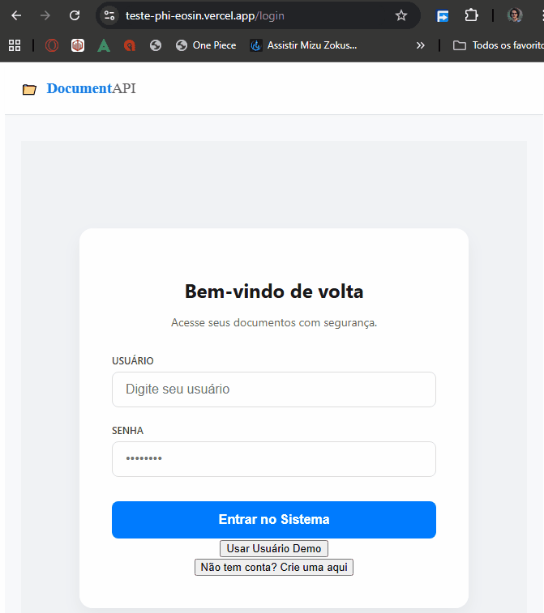

# 👋 Olá, sou Wilcleyber!

🎓 **Estudante de Análise e Desenvolvimento de Sistemas**, e aqui compartilho meus projetos reais — criados com automação, prática e muito aprendizado!

💡 Acredito que o melhor aprendizado vem de colocar a mão no código, testar, errar e ajustar até funcionar.  
Este espaço é o reflexo da minha jornada como desenvolvedor em formação.

---

## 💻 Tecnologias
Python | Tkinter | HTML | CSS | JavaScript | Node.js | API REST | PostgreSQL | SQLite

---

## 📂 Projetos Recentes

### 🧑‍💼 HRLite – Gestão de Colaboradores  
  
[🔗 Testar o projeto](https://wilcleyber.github.io/HRLite_Frontend/)

> ⚠️ *Nota:* Ao abrir o sistema, pode levar alguns segundos para os dados aparecerem. Isso acontece porque a API está hospedada gratuitamente no Render e pode estar hibernando.

### 🌦️ Previsão do Tempo  
  
[🔗 Testar o projeto](https://wilcleyber.github.io/Previsao_do_Tempo-Frontend-/)

### 📚 SmartBudget 
  
[🔗 Testar o projeto](https://wilcleyber.github.io/smartbudget-frontend/)

⚠️ *Nota:* Ao abrir o sistema, pode levar alguns segundos para os dados aparecerem. Isso acontece porque a API está hospedada gratuitamente no Render e pode estar hibernando.

---

## ✉️ Contato
[💼 LinkedIn](https://www.linkedin.com/in/wilcleyber/)  
[📧 E-mail](mailto:wilcleyber2@gmail.com)

---

⭐ *“Aprender é transformar curiosidade em resultados.”*  
