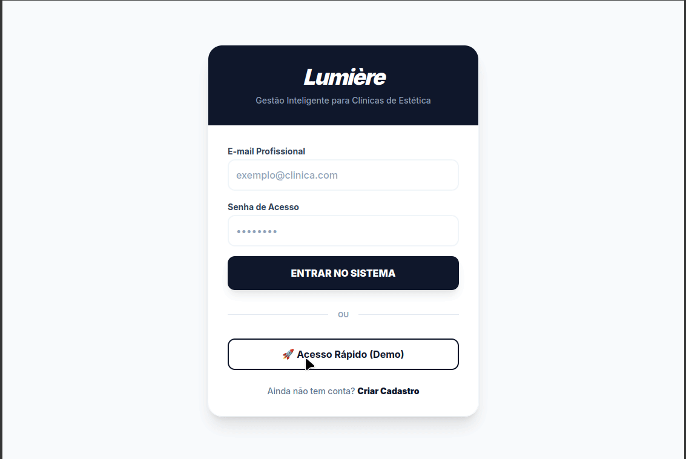
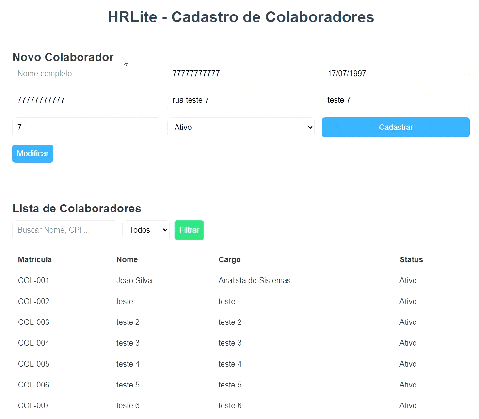
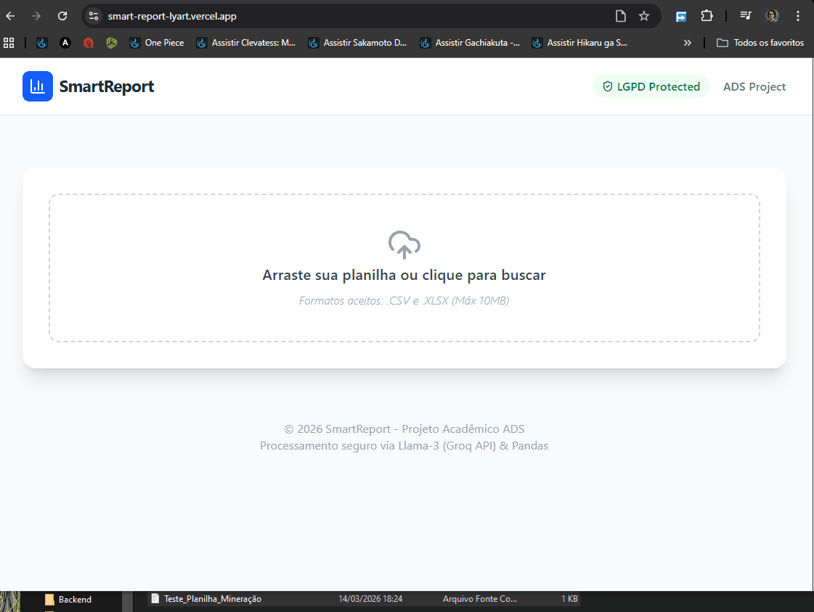

# 👋 Olá, sou Wilcleyber (Wil)!

🚀 **Desenvolvedor Full Stack | Estagiário de Tecnologia na Vale S.A. | Estudante de ADS (Uninassau)**

Sou um entusiasta de eficiência focado em transformar lógica complexa em soluções inteligentes e interfaces fluidas. Apaixonado por IA's, integro LLMs e arquiteturas RAG para criar aplicações que realmente impactam a produtividade e a gestão operacional.

---

📂 **Projetos em Destaque**

# 💎 Lumière: Gestão para Estética & Bem-Estar
  
[🔗 Testar Aplicação](https://lumiere-ten-vert.vercel.app) | [📁 Repositório do Projeto](https://github.com/Wilcleyber/Lumiere.git)

> **Tech Stack:** Next.js 15 (App Router), TypeScript, Tailwind CSS (Luxury Edition), Supabase (Real-time DB & Auth), Google Gemini AI.
> **Destaque:** Ecossistema AI-First projetado para o mercado de estética. O Lumière elimina a carga cognitiva do gestor através de uma arquitetura Serverless, unificando agendamentos, dashboards financeiros e uma camada de IA que atua como um CFO virtual.

# 🛡️ RAC's-IA: Assistente Inteligente de Segurança Operacional (RAG)
 
[🔗 Testar Aplicação](https://rac-ia.vercel.app/) | [📁 Repositório Backend](https://github.com/Wilcleyber/RAC-s_IA_Backend.git) | [📁 Repositório Frontend](https://github.com/Wilcleyber/RAC-s_IA_Frontend.git)

> **Tech Stack:** React (TypeScript), FastAPI (Python), ChromaDB (Vector DB), Llama-3 (Groq API), HuggingFace (Embeddings), Web Speech API.
> **Destaque:** Implementação avançada de RAG (Retrieval-Augmented Generation) para consulta de normas técnicas. Possui interface por voz e orquestração de APIs externas para garantir respostas em milissegundos.

# 📊 SmartReport: AI-Driven Data Analysis & Reporting
  
[🔗 Testar o projeto](https://smart-report-lyart.vercel.app) | [📁 Repositório Backend](https://github.com/Wilcleyber/SmartReport.git) | [📁 Repositório Frontend](https://github.com/Wilcleyber/SmartReport_Frontend.git)

> **Tech Stack:** React (Vite/TS), Tailwind CSS, FastAPI, Pandas, Llama-3 (Groq API), ReportLab.
> **Destaque:** Automatização total do fluxo de dados: desde o upload de planilhas e análise preditiva via IA até a exportação de relatórios profissionais em PDF multi-página.

---

## 🛠️ Habilidades Técnicas

* **Linguagens:** Python, TypeScript, JavaScript (ES6+), SQL.
* **Modern Full Stack:** Next.js 15, React, FastAPI, Node.js, Server Actions.
* **IA & Engenharia de Dados:** Arquitetura RAG, Bancos Vetoriais (ChromaDB), Integração de LLMs (Groq/Llama-3/OpenAI), Prompt Engineering.
* **Cloud & Infra:** Supabase (BaaS), PostgreSQL, Docker, Git/GitHub, Deploy (Vercel/Render).
* **Design:** Tailwind CSS, Design Systems, UI/UX focado em performance.

## ✉️ Contato

